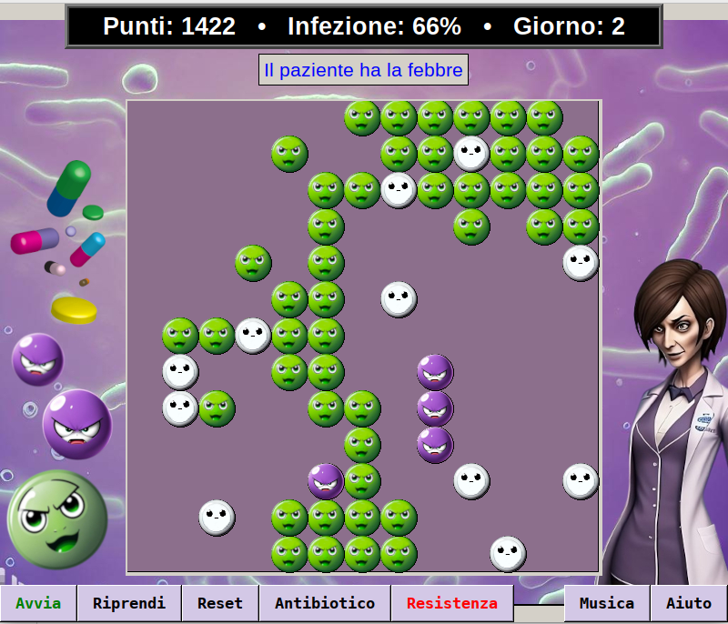

# GameOfBacteria
An educational simple game to show interaction between antbiotics and bacteria. Windows Binary available in releases.

<code>git clone https://github.com/davidegat/GameOfBacteria.git</code>

[**README IN ITALIANO**](#italiano)

# Bacteria vs. Antibiotics

## Game Rules

**1. Green cells are bacteria. Purple if resistant to antibiotics:**

   - They replicate during the game and are killed by antibiotics.

**2. White cells are antibiotics. Administer them by pressing 'Antibiotico':**

   - You can treat infection only when it starts causing symptoms.
   - Antibiotics are depleted and must be administered regularly.
   - Patient dies if he gets too many antibiotics.
   - If antibiotics run out, bacteria become resistant.

**3. You can cause resistance by pressing 'Resistenza':**

   - Resistent bacteria require higher antibiotic doses.
   - They try not to be reached by antibiotics.
   - If a resistant bacterium dies, it deactivates an antibiotic molecule.
   - Deactivated antibiotics turn yellow and are destroyed.
   - If you administer antibiotics for too many consecutive days, you will develop resistance.
   - You have a 5% chance of curing a patient with resistance but also a chance to receive random bonuses.

**4. Even if patient is not infected with a resistant bacteria, you can encounter three levels of difficulty:**

   - Easy: patient has a phenomenal immune system.
   - Routine: immune system works, but don't underestimate anything.
   - Difficult: patient is immunosuppressed; infection will be tough.

**5. Be mindful of time; these circumstances can make you lose points:**

   - If treatment lasts too long, patient may become depressed.
   - Patient may worsen and die with prolonged treatment.
   - Long working hours and fatigue could lead you to errors in therapy.

You must decide when to start treatment and how frequently to continue it.

**Caution: Resistance requires more antibiotics, but you might kill the patient!**

Bacteria will pass resistance through their plasmids.
If resistance develops, you must have enough points to sustain the final challenge, which will be ONLY against resistant bacteria.

Tip: your medical supervisor is breathing down your neck, waiting for your next mistake!

## Scoring

**You receive points for:**

   - Duration of patient's life without symptoms.
   - Killing resistant and non-resistant bacteria.
   - Curing the disease.

**Points are deducted for:**

   - Endangering patient.
       - Causing resistance.
       - Risk of sepsis.
       - Overusing antibiotics.
       - Taking too long to cure patient.
       - Administering the wrong therapy: this happens if treatment is too long (red cells).
   - Patient's death.
   - Antibiotic administration.
   - Each duplication of a resistant or non-resistant bacterium.
   - If you are fired by medical supervisor.

**Keyboard Shortcuts:**

   - ENTER: Administer a dose of antibiotic.
   - SPACE: Develop resistance.
   - ESC: Restart game.

Good luck in your fight against infection!
## Disclaimer

This software is provided "as is," without any express or implied warranties of its operation.

Use of this software is at your own risk. Author assumes no responsibility for direct, indirect, incidental, or consequential damages resulting from the use, proper or improper, of this software.

By using this software, you agree to be bound by the terms of this disclaimer.

Source code of this software is distributed under the GPL-3.0 license. Audio effects, images and icons are excluded.
[GPL-3.0 License](https://www.gnu.org/licenses/gpl-3.0.en.html)

Feel free to fork, improve, spread an translate this code as you want within the license.

**Notes:**
- Audio effects used in this software are from free sources, so they can be considered without a license or under a Fair Use license.
- Music is generated with Beatoven.ai, under non exclusive music license ("Crabby Cream" - License: 224af568-e32f-4452-a9ae-bb40bcf3777a). You can use (but not make money with) this music freely, but keep an eye to Beatoven.ai terms of service as they may change in time.
- All images used in this software are made by generative AI (StableDiffusion, DALL-E) and so (maybe) copyright free.
- Python code is written both by human and AI, and released under GPL 3.0 license.

Purpose of the software is to entertain and, at best, provide a fun way to understand behavior of bacteria and antibiotics.

Simulations in this game are quite realistic but still influenced by random events for entertainment purposes. They may not always represent real treatment situations or real situations in general.

It is responsibility of the teacher, and an exercise for students, to understand when the outcome of a game can be compared to real events to get a stimulus to understand an study deeper.

Software developer does not assume responsibility for the accuracy of medical information included.

This game can be a support for study but requires the presence and/or explanations of an expert teacher who can benefit from simulations in classroom.

Students approaching this game to gain knowledge must responsibly compare medical information presented in-game with those from accredited or recognized sources.

---
**README (Italiano)**

# Batteri contro Antibiotici
Un semplice gioco educazionale per mostrare l'interazione fra antibiotici e batteri. La versione per Windows è disponibile nelle releases.

<code>git clone https://github.com/davidegat/GameOfBacteria.git</code>

## Regole del gioco

**1. Le celle verdi sono batteri. Viola se resistenti agli antibiotici:**

   - Si duplicano durante il gioco e vengono uccisi dall'antibiotico.

**2. Le celle bianche sono antibiotici. Somministrali premendo 'Antibiotico':**

   - Puoi curare l'infezione solo quando inizia a causare sintomi.
   - L'antibiotico viene eliminato, va somministrato regolarmente.
   - Il paziente muore se assume troppi antibiotici.
   - Se l'antibiotico finisce, i batteri diventano resistenti.

**3. Puoi causare una resistenza premendo 'Resistenza':**

   - I batteri necessitano maggiori dosi di antibiotico.
   - Cercano di non farsi raggiungere dall'antibiotico.
   - Se un battere resistente muore, disattiva una molecola di antibiotico.
   - Gli antibiotici disattivati diventano gialli e vengono distrutti.
   - Se somministri antibiotici per troppi giorni consecutivi, svilupperai una resistenza.
   - Hai il 5% di possibilità di ricoverare un paziente con una resistenza, ma anche la possibilità di ricevere dei bonus casuali.

**4. Anche se il paziente non è infetto da un battere resistente, puoi incontrare tre livelli di difficoltà:**

   - Facile: La persona ha un sistema immunitario fenomenale!
   - Routine: Il sistema immunitario funziona, ma non sottovalutare niente!
   - Difficile: La persona è immunodepressa, l'infezione sarà tosta!

**5. Fai attenzione al tempo; queste circostanze possono farti perdere punti:**

   - Se la cura dura troppo, il paziente potrebbe deprimersi.
   - La persona potrebbe anche peggiorare e morire, con una cura troppo lunga.
   - La stanchezza potrebbe farti commettere errori nella terapia.

Dovrai decidere quando iniziare la terapia e con che frequenza continuarla.

**Attenzione: una resistenza richiede più antibiotici, ma potresti uccidere il paziente!**

I batteri si passeranno la resistenza tramite i loro plasmidi.
Se si sviluppa una resistenza, dovrai avere abbastanza punti per sostenere la sfida finale, che sarà SOLO contro batteri resistenti.

Una dritta: il tuo responsabile medico ti è alle calcagna, aspetta solo il tuo ennesimo errore per licenziarti!

## Punteggio

**Si ricevono dei punti per:**

   - Durata della vita del paziente senza sintomi.
   - Uccisione batteri resistenti e non.
   - Guarigione dalla malattia.

**Vengono sottratti punti per:**

   - Per la messa in pericolo del paziente.
       - Se si causano resistenze.
       - Se c'è il rischio di setticemia.
       - Se si esagera con gli antibiotici.
       - Si impiega troppo tempo a curare la persona.
       - Somministrando la terapia sbagliata: succede se la cura è troppo lunga (celle rosse).
   - Alla morte del paziente.
   - Alla somministrazione dell'antibiotico.
   - Ad ogni duplicazione di un battere resistente o meno.
   - Se si viene licenziati dal responsabile medico.

**Scorciatoie da tastiera:**

   - INVIO: Somministra una dose di antibiotico.
   - SPAZIO: Sviluppa una resistenza.
   - ESC: Riavvia il gioco.

Buona fortuna nella tua lotta contro l'infezione!

## Disclaimer

Questo software è fornito 'così com'è', senza alcuna garanzia, esplicita o implicita, sul suo funzionamento.

L'uso di questo software è a proprio rischio e pericolo. L'autore non si assume alcuna responsabilità per danni diretti, indiretti, accidentali o consequenziali derivanti dall'uso, proprio o improprio, di questo software.

Continuando a utilizzare questo software, l'utente accetta di essere vincolato dai termini di questo disclaimer.

Il codice sorgente di questo software è distribuito sotto la licenza GPL-3.0, non sono inclusi gli effetti audio, le immagini e le icone:
[GPL-3.0 License](https://www.gnu.org/licenses/gpl-3.0.en.html)

Sentitevi liberi di fare un fork, migliorare, diffondere e tradurre questo software a vostro piacimento entro i termini della licenza.

**Note:**
- Gli effetti audio utilizzati in questo software provengono da fonti gratuite, e da considerarsi senza licenza sotto una licenza che permette il "Fair Use"
- La musica è generata con Beatoven.ai ed usata con licenza non esclusiva valida in tutto il mondo. ("Crabby Cream"  license 224af568-e32f-4452-a9ae-bb40bcf3777a). Per quello che mi riguarda, potete usare (non farci i soldi con) questa musica, ma tenete un'occhio sui termini di servizio di Beatoven.ai, dato che potrebbero cambiare nel tempo.
- Tutte le immagini usate in questo software sono ottenute tramite AI generativa (StableDiffusion, DALL-E) e quindi (probabilmente) senza copyright.
- Programmato in linguaggio Python da mente umana e intelligenza artificiale, e rilasciato sotto licenza GPL 3.0.

Lo scopo del software è divertire, al massimo fare comprendere in modo divertente il comportamento di batteri e antibiotici.

Le simulazioni in questo gioco sono piuttosto realistiche, ma restano comunque influenzate da eventi casuali (anche per scopo di intrattenimento), e potrebbero non rappresentare sempre situazioni reali di cura, o reali in generale.

È responsabilità del docente, ed un esercizio per lo studente, comprendere quando il risultato di una partita possa essere confrontato con eventi reali, al fine di ricevere uno stimolo ad approfondirli.

Lo sviluppatore del software non si assume la responsabilità per l'accuratezza delle informazioni mediche incluse.

Il gioco può essere un supporto per lo studio, ma necessita della presenza e/o delle spiegazioni di un docente esperto, che può trarne vantaggio per proporre delle simulazioni in aula.

Lo studente che si approccia a questo gioco per ricevere delle nozioni, deve responsabilmente confrontare le informazioni mediche presentate nel gioco con quelle di fonti accreditate o riconosciute.

©2023 Davide Nasato
